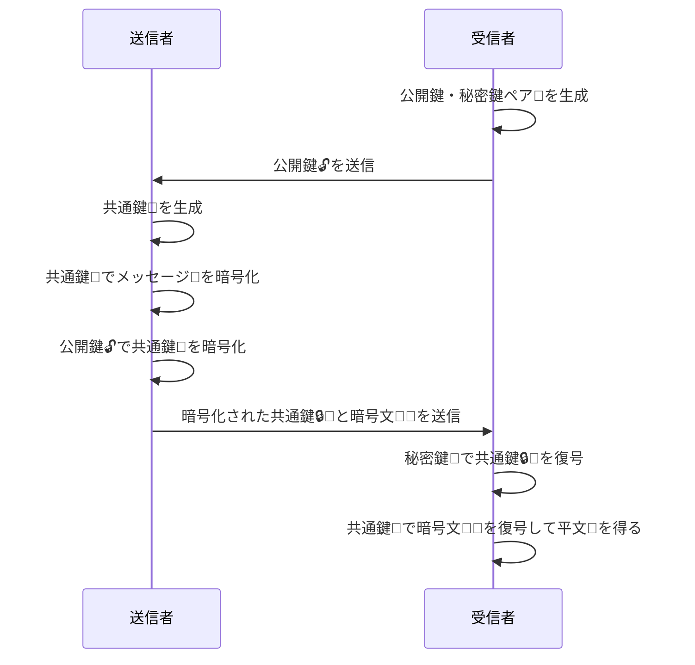

## 公開鍵暗号とは

データを暗号化して扱いたいことがあります。インターネットで誰かと通信するときは、通信経路で誰が盗み見ているか分かりません。送信者と受信者だけが中身を確認できるように暗号化を施しておくと安心です。他には、データベースに保存するようなシステムを開発するとき、センシティブなデータを暗号化して保存しておくことで安心感が得られるかもしれません(得られないかもしれません)。

人間が読める状態のデータを平文、読めないように暗号化されたデータを暗号文と呼びます。また、暗号文を平文に戻すことを復号と呼びます。

以前共通鍵暗号についての記事を書きました。

https://zenn.dev/stin/articles/5e0870eaaf9bb0

共通鍵暗号は暗号化と復号に同じ鍵を用いる暗号方式でした。

それに対して**公開鍵暗号**は暗号化と復号で異なる鍵を用います。片方を公開鍵、もう一方を秘密鍵と呼びます。鍵はペアで生成され、公開鍵で暗号化した暗号文は対応する秘密鍵でしか復号出来ないようになっています。

公開鍵は暗号化専用なので誰に渡しても良いです。インターネットに公開されたWebサイトに載せてもいいし、街の掲示板に貼ってもいいです。

一方で秘密鍵は誰にも知られないようにしなければなりません。

公開鍵暗号による通信は次のステップで行われます:

1. 受信者が鍵ペアを生成する(最初の一度だけ)
2. 受信者が公開鍵を送信者に渡す
3. 送信者がメッセージを公開鍵で暗号化する
4. 送信者が暗号文を受信者に送る
5. 受信者が暗号文を秘密鍵で復号する

これによって共通鍵暗号の**鍵配送問題**を解消します。

### 鍵配送問題とは

共通鍵暗号では暗号化と復号で同じ鍵を使うため、暗号文を送受信するためには送信者と受信者が同じ鍵を持っておく必要がありますね。

鍵も一種のデータなので、ネットワーク(インターネット)越しの相手に渡す場合は盗聴のリスクに晒されます。盗聴されないようにデータを暗号化しているのに、暗号化に用いる鍵は守れないであっては本末転倒です。

また、鍵を安全に渡せる環境であればそもそもメッセージの暗号化は必要なのか？という疑問も生じます。信頼出来る人間だけに閉じたネットワークを使っているなら、暗号化せずとも安心してメッセージを送れるはずです。

## RSA

RSAは公開鍵暗号の一種です。名前は3人の発明者の頭文字を並べたものです。

$m$を平文に相当する自然数、$c$ を暗号文に相当する自然数とします。また、$n$, $e$, $d$ も自然数とします。RSAにおいて、暗号文と平文の関係は次のような数式で表されます。

$$
\begin{aligned}
c &= m^e \mod n \\
m &= c^d \mod n
\end{aligned}
$$

$\mod n$ は剰余演算子で、$n$ で割った余りを意味します。

ここでは具体的な解説はしませんが、$n$, $e$, $d$ は密接な関わりを持って値が選択されます。$n$ はRSAの法、$e$ は公開指数、$d$ は秘密指数と呼ばれます。

RSAでは $(n, e)$ を公開鍵、$(n, d)$ を秘密鍵として扱います。$(n, e)$ は公開されているので、誰でも暗号文 $c$ を計算できます。$d$ を誰も知らない秘密の値にすることで、$d$ を知っている人だけが暗号文 $c$ から平文 $m$ を算出することができます。

RSAは、非常に大きな自然数の素因数分解が難しいことを安全性の根拠としています。仮に $n$ の素因数分解が簡単にできれば、$d$ を計算することができてしまい、結果として暗号は破られることになります。

## RSA-OAEP(Optimal Asymmetric Encryption Padding)

RSAの数式は非常に単純で、ランダム性がないことがわかります。つまり、同じ平文は必ず同じ暗号文に計算されます。これでは、暗号文と平文のペアを収集されることで、暗号文から平文を推測される可能性があります。公開鍵暗号では暗号化は誰でもでき、手元で計算するだけでよいため、暗号文を収集するのは容易です。
そもそも平文 $m$ が 0 や 1 の場合は暗号文 $c$ も 0 や 1 になります。復号するまでもなく暗号文から平文が判定できてしまいますね。
また、暗号文 $c$ が改竄されていても、復号するときに改竄されていることに気付けないという問題があります。$c$ は単なる自然数なので、当たり前といえば当たり前ですね。

そのような、RSAを素で使うことによる問題を解決するためにRSA-OAEPというパディング方式が考案されています。

RSA-OAEPでは、ランダムな値とハッシュ関数を暗号ステップに組み込みます。これにより、暗号文のランダム性と改竄検知を実現します。

## TypeScriptでRSAを使う

TypeScriptで暗号を扱う際は、Web Crypto APIやNode.jsの`node:crypto`モジュールを使います。この記事では汎用性を考慮して、Web Crypto APIを使って公開鍵暗号による暗号化と復号に触れてみましょう。

```tsx
const textEncoder = new TextEncoder();
const textDecoder = new TextDecoder();

const cryptoKeyPair = await crypto.subtle.generateKey(
  {
    name: "RSA-OAEP",
    modulusLength: 4096,
    publicExponent: new Uint8Array([1, 0, 1]),
    hash: "SHA-256",
  },
  true,
  ["encrypt", "decrypt"],
);

const plaintext = textEncoder.encode(
  "ぼくはまちちゃん！ こんにちはこんにちは!!",
);

const encryptedText = await crypto.subtle.encrypt(
  {
    name: "RSA-OAEP",
  },
  cryptoKeyPair.publicKey,
  plaintext,
);

console.log("Encrypted:", textDecoder.decode(encryptedText));

const decryptedText = await crypto.subtle.decrypt(
  {
    name: "RSA-OAEP",
  },
  cryptoKeyPair.privateKey,
  encryptedText,
);

console.log("Decrypted:", textDecoder.decode(decryptedText));
```

このコードを実行すると、次のような出力が得られます。

```bash
Encrypted:
           EH8���?x!e_
�o��G7�)�gw�H@����[�~V���wY��*�
(��B�Y3��KC��h�5���i��gn�]     #IJK���
�ƈa�ؗ�|�%�o�C��+�^����q��F.ox��m��s�%]+|U�w�O��s���Ǔ��fp�I=[��o�Z:�Q�
�tS�!���_��TzZ͈!��ƹO�A$��:!�6����6�N�j��+�ˇ�S=  f�#���3��!��,�?<�3t�rt�-�}�z��͗�2�ǒ\�&���*�ZHP8��BzZ��j���A3�-yܨ2K'ч��J=3��f��QL��{�5�l��$v=������U*��O���8Z�������m���&�%]�d�qH����3�]2n�&I��MxZ�=�
Decrypted: ぼくはまちちゃん！ こんにちはこんにちは!!
```

確かに暗号文はぐちゃぐちゃで読めませんね(`encrypt`にランダム性が含まれるため、出力は毎回異なります)。そして復号されたテキストは元ののテキストと一致しています。

ひとつずつ見ていきましょう。

### 鍵ペアの生成

公開鍵暗号では2つの対になる鍵を生成します。鍵は2つですが一度の生成関数の呼び出しでペアが生成されます。

```ts
const cryptoKeyPair = await crypto.subtle.generateKey(
  {
    name: "RSA-OAEP",
    modulusLength: 4096,
    publicExponent: new Uint8Array([1, 0, 1]),
    hash: "SHA-256",
  },
  true,
  ["encrypt", "decrypt"],
);
```

Web Crypto APIの`generateKey`関数を使います。呼び出す関数は共通鍵暗号の鍵生成と同じですが、共通鍵暗号のためのパラメーターを渡した場合は戻り値が`CryptoKey`型になるのに対して、公開鍵暗号のためのパラメーターを渡すと戻り値は`CryptoKeyPair`型になります。

`name` には `RSA-OAEP` を指定します。Web Crypto APIでの公開鍵暗号の暗号化は RSA-OAEP だけが指定可能です(デジタル署名用途では別のアルゴリズムを指定します)。暗号利用モードを3つから選べる共通鍵暗号(AES)とは違って選択の余地がありません。

`modulusLength`はRSAの法のサイズを指します。鍵の強度に関わるパラメーターです。大きいほど強度が高くなりますが、計算量も増えます。[MDNでは2048ビット以上を指定することが推奨](https://developer.mozilla.org/ja/docs/Web/API/RsaHashedKeyGenParams#moduluslength)されていますが、2048ビットでも2030年までには強度が足りなくなると言われています。[^1]

[^1]: [CRYPTREC 暗号強度要件（アルゴリズム及び鍵長選択）に関する設定基準](https://www.cryptrec.go.jp/list/cryptrec-ls-0003-2022r1.pdf) の「表 2 公開鍵暗号の推定セキュリティ強度」と「表 5 セキュリティ強度要件の基本設定方針」より

`publicExponent`は公開指数です。型としては`Uint8Array`を指定します。特に理由がない限り、必ず`new Uint8Array([1, 0, 1])`(10進数で65537)を指定します。理論的には条件さえ満たす任意の値を指定可能ですが、計算効率やセキュリティの観点から65537が広く使われています。

`hash`はOAEPで用いるハッシュ関数を指定します。SHA-256を指定しましたが、SHA-1やSHA-384, SHA-512なども利用可能です。ただし暗号用途なのでSHA-1は新規利用では非推奨です。

生成した公開鍵を外部に公開したり秘密鍵をどこか秘密の場所に保存しておくために、鍵のエクスポートができます。`generateKey`関数の第2引数でエクスポート可能かどうかを指定します。`true`で生成された鍵に対して`exportKey`関数を使用することで鍵を`ArrayBuffer`またはJSON Web Key(JWK, プレーンなJSオブジェクト)に変換できます。

```ts
await crypto.subtle.exportKey("jwk", cryptoKeyPair.publicKey);
```

サンプルコードではサンプルコードでは鍵の生成と暗号化・復号まで一気に書いていますが、RSAの鍵ペアの生成は非常に遅いため、通常は事前に一度だけ生成した鍵ペアを使い回すような設計になります。

### 暗号化

```ts
const encryptedText = await crypto.subtle.encrypt(
  {
    name: "RSA-OAEP",
  },
  cryptoKeyPair.publicKey,
  plaintext,
);
```

`crypto.subtle.encrypt`関数を使って暗号化を行います。第一引数には暗号化のパラメーターを指定します。前述の通り、`RSA-OAEP`のみ指定可能です[^2]。

[^2]: [電子政府における調達のために参照すべき暗号のリスト （CRYPTREC暗号リスト）](https://www.cryptrec.go.jp/list/cryptrec-ls-0001-2022r1.pdf) でも、公開鍵暗号の守秘は `RSA-OAEP` だけがリストアップされています

第2引数は公開鍵です。このコード例では直前に生成したオブジェクトを利用していますが、通常のアプリケーションでは実際に公開されている鍵を取ってきて利用したり、ソースコードにハードコードされているものを使ったりするでしょう。

第3引数は平文を指定します。平文はバイナリデータを要求されるので、文字列の場合は`TextEncoder`で処理します。平文のサイズ上限は法のサイズとハッシュ関数次第ですがかなり小さいです。例えば法が4096ビットでハッシュ関数が`SHA-256`の場合、平文は446バイト以下に制限されます。

ところで、共通鍵暗号では初期化ベクトル(IV)またはカウンターの初期値を別で乱数生成して、自分で平文とセットにして保存しておく必要がありました。RSA-OAEPでは自分で乱数を生成して保存しておく必要はなく、`encrypt`の中で勝手にやってくれます。

### 復号

```ts
const decryptedText = await crypto.subtle.decrypt(
  {
    name: "RSA-OAEP",
  },
  cryptoKeyPair.privateKey,
  encryptedText,
);
```

復号は`crypto.subtle.decrypt`関数を使います。第一引数には暗号化と同じく暗号化のパラメーターを指定します。ここでも`RSA-OAEP`のみが指定可能です。

第2引数には秘密鍵を指定します。この秘密鍵は誰にも知られないように管理されている必要があります。

第3引数には復号対象の暗号文を指定します。

これで平文の`ArrayBuffer`が手に入ります。

## ハイブリッド暗号

公開鍵暗号の計算は非常に遅いです。また暗号文が平文よりも大きくなるため、テキストメッセージや画像を直接暗号化してやり取りするようなユースケースには向いていません。そもそも平文として与えるデータのサイズ上限があり、画像どころかテキストデータすらまともに扱えない可能性があります。

ではどう扱うかというと、共通鍵暗号と組み合わせてハイブリッド暗号として使用します。

共通鍵暗号の弱点は鍵を安全に配送できないことでした。一方で公開鍵暗号なら暗号用の鍵を誰にでも気軽に渡せます。2つを組み合わせることで、共通鍵暗号の鍵を公開鍵暗号の公開鍵で暗号化して送信することが可能です。

以下はハイブリッド暗号の流れを示すシーケンス図です。



ポイントは、共通鍵を公開鍵暗号にとっての平文とみなして、「一時的な共通鍵暗号の共通鍵」を「公開鍵暗号の公開鍵」で暗号化して送信することです。受信者は、まず自分だけが持っている秘密鍵で共通鍵を復号し、その共通鍵を使って改めて本文の復号を行います。

共通鍵の鍵のサイズは128ビット程度と軽量です。そのため、公開鍵暗号のサイズ上限を気にせずに共通鍵を暗号化できます。

ハイブリッド暗号よって、次のようなメリットが得られます。

- 共通鍵暗号の高速な暗号化・復号を利用できる
- 公開鍵暗号の鍵配送問題を解決できる
- 暗号用の鍵を気軽に公開できる

### 前方秘匿性

悪意のある攻撃者が、過去の通信すべての「暗号済み共通鍵」と「暗号文」を盗んで保存していたとします。うっかり秘密鍵を漏洩してしまった場合、攻撃者はその秘密鍵から過去すべての共通鍵を復号でき、そして過去すべての暗号文を復号できてしまいます。

このような秘密鍵の漏洩に対して過去の通信の秘匿が守られることを**前方秘匿性**と呼びます。残念ながら、ここで紹介したハイブリッド暗号は前方秘匿性を持ちません。秘密鍵が漏洩すれば、その秘密鍵で行われた通信はすべて読めてしまうからです。

TLS1.3では前方秘匿性が重視され、RSAによる鍵交換は廃止されました。代わりに、DH鍵交換やECDH鍵交換が使用されます。これらは、通信するペアがおぼろげながら浮かんできた数値を言い合うだけで共通鍵が作れる不思議な仕組みです。

こういった事情もあり、公開鍵暗号を秘匿目的に使うことは減っているかと思います。公開鍵暗号の用途は**デジタル署名**が主流となってきています。デジタル署名についてはまた別の記事で…。

## まとめ

公開鍵暗号をTypeScriptで使う方法を紹介しました。

公開鍵暗号は、共通鍵暗号の鍵配送問題を解決するために考案された暗号方式です。RSA-OAEPはその一種で、ランダム性と改竄検知を組み込んだパディング方式を採用しています。

TypeScriptではWeb Crypto APIや`node:crypto`モジュールを使って公開鍵暗号を扱うことができます。本記事ではWeb Crypto APIを使用して、RSA-OAEPによる暗号化と復号の基本的な流れを示しました。

ハイブリッド暗号を使うことで、共通鍵暗号の高速な暗号化と公開鍵暗号の鍵配送問題を両立できます。ただし、公開鍵暗号は計算量が大きいため、実際のアプリケーションでは共通鍵暗号と組み合わせて使用することが一般的です。ただし、ハイブリッド暗号は前方秘匿性を持たないため、秘密鍵の漏洩には注意が必要です。

それでは良い暗号ライフを！
