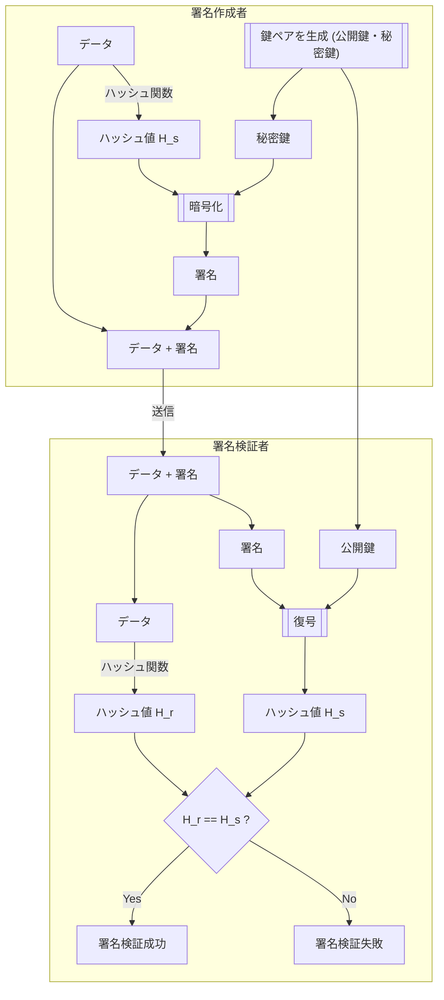

## デジタル署名とは

配布されているデータを受け取るとき、受け取ったデータが本当に配布している人から来たものかを確認したいことがあります。

例えば便利なソフトウェアをダウンロードできるサイトがあるとしましょう。そのソフトウェアをダウンロードしてインストールしますが、ダウンロードしたそのバイナリは本当にそのソフトウェア開発者が提供したものでしょうか？実はサイトが改竄されていて、マルウェアを仕込まれたソフトウェアを配っているかもしれません。

デジタル署名は、データに対して追加の署名データを付与します。データの受け取り側がその署名データを検証することで、次のことを確認できます。

- 受け取ったデータが署名作成時点のデータと完全一致すること
- 誰が署名を作成したのか[^1]

[^1]: 厳密には「どの秘密鍵で署名されたか」が確認できるだけで、公開鍵の発行者が誰かを保証するには「証明書」の仕組みが必要です。本記事は簡略化のため「誰が」と書いています。

一方で、デジタル署名は暗号化ではないため、データの内容は秘密にしません。データを秘密にしたい場合は、別途暗号化を行う必要があります。

## デジタル署名の仕組み

デジタル署名のうち、RSA 署名は RSA 公開鍵暗号とハッシュ関数を組み合わせて実現される技術です。公開鍵暗号とハッシュ関数については、以前別の記事で紹介したので御覧ください。

https://zenn.dev/stin/articles/459732c7f30b4e
https://zenn.dev/stin/articles/161ebd7d45089b3446ee4e0d86dbcf92

公開鍵暗号を用いるので、鍵ペア(公開鍵、秘密鍵)を作成しておく必要があります。その名の通り、秘密鍵は発行者本人だけが保持する秘密の鍵で、公開鍵は誰にでも公開してよい鍵です。

署名作成者は、次のステップで署名を生成します。

1. データをハッシュ関数に通してハッシュ値を得る
1. そのハッシュ値を秘密鍵で暗号化して署名とする
1. データに署名を添付して配布する

データを受け取った側は、次のステップで署名を検証します。

1. 受け取ったデータのハッシュ値を署名生成と同じハッシュ関数に通してハッシュ値 $H_1$ を得る
1. 添付された署名を公開鍵で復号して署名者が計算したハッシュ値 $H_2$ を得る
1. $H_1$ と $H_2$ が一致すれば署名検証成功、一致しなければ失敗とする

これらのステップを図示すると次のようになります。



公開鍵暗号を用いていますが、暗号化対象がハッシュ値であることがポイントです。暗号化の操作は行いますが、データ自体を秘匿することが目的ではありません。ここでは、「署名者だけが秘密鍵を使ってハッシュ値から計算できる値」を得ることが目的です。検証側はその値を復号すれば、署名者が署名作成時に計算したハッシュ値を得られます。

「署名者だけが秘密鍵を使って計算できる値」が欲しいのであれば、ハッシュ値ではなく元データに対して直接暗号化を行っても良さそうに思えます。しかし、公開鍵暗号の計算コストは非常に高いことが知られており、また平文サイズに比例します。平文サイズは様々で、画像や動画などの大きなデータである場合もあるため、元データに対して直接公開鍵暗号を適用するのは非現実的です。ハッシュ値は元データのサイズにかかわらず固定長であるため、公開鍵暗号の計算コストを低く抑えられます。

秘密鍵は署名者だけが保持しているため、署名(ハッシュ値の暗号文)を生成できるのは署名者だけです。ハッシュ関数は同じデータから必ず同じ値が出力され、1bit でも異なれば出力が大きく変わる性質を持ちます。これらの性質を組み合わせることで、「受け取ったデータが署名作成時点のデータと完全一致すること」と「誰が署名を作成したのか」を検証者が確認できます。

## RSA-PSS

ただし、ここまで説明した単純な「ハッシュ関数 + 公開鍵暗号」署名方式にはセキュリティ上の問題があります。

RSA は単なる数値の演算なので、任意の値で計算が可能です。そして公開鍵は誰でも知っているので、任意の値 S から公開鍵で計算した H を得られます。もし攻撃者が S が署名で H がハッシュ値であると主張すれば、他の人もその値で署名検証が成功してしまいます(存在的偽造)。

単なる「ハッシュ関数 + 公開鍵暗号」を改善して、安全な署名方式として設計されたのが RSA-PSS です。RSA-PSS では、署名生成時にランダムな値(salt)を取り入れることで、同じデータでも異なる署名データが生成されるようになっています。

## TypeScript でデジタル署名を使う

TypeScript では、Web Crypto API を使ってデジタル署名を作成したり検証することができます。

### 鍵ペアの生成

まずは署名の作成と検証に使う鍵ペアの生成です。

```ts
const cryptoKeyPair = await crypto.subtle.generateKey(
  {
    name: "RSA-PSS",
    modulusLength: 2048,
    publicExponent: new Uint8Array([1, 0, 1]),
    hash: "SHA-256",
  },
  true,
  ["sign", "verify"],
);
```

アルゴリズム名には `"RSA-PSS"` を指定します。署名作成用としては他に `"RSASSA-PKCS1-v1_5"`,`"ECDSA"`, `"HMAC"`, `"d25519"` があります。

`modulusLength` は RSA の法のサイズを指します。鍵の強度に関わるパラメーターです。2048 bit 以上を指定するのが推奨されています。

`publicExponent` は公開指数です。一般的には `65537` (16 進数で `0x10001`) が使われます。`Uint8Array` で指定します。

`hash` にはハッシュ関数の名前を指定します。

第2引数は鍵をエクスポートできるかどうかを指定します。公開鍵を他人に譲渡する必要があるので、`true` にしておきます。

第3引数は鍵の用途を選びます。署名の作成と検証に使う鍵ペアなので、`"sign"` と `"verify"` を指定します。

鍵をエクスポートするには、次のように `exportKey` メソッドを使用します。

```ts
const publicKeyJwk = await crypto.subtle.exportKey(
  "jwk",
  cryptoKeyPair.publicKey,
);

console.log(publicKeyJwk);
```

`"jwk"` は JSON Web Key フォーマットで、暗号鍵を JSON で表現する標準フォーマットです。他にも`exportKey` メソッドが出力するフォーマットの選択肢はあります。また、公開鍵だけでなく秘密鍵も同じメソッドでエクスポート可能です。

上記コードを実行すると次のようなプレーンオブジェクトが得られます。

```js
{
  key_ops: [ 'verify' ],
  ext: true,
  alg: 'PS256',
  kty: 'RSA',
  n: '4E8GWI9ukuATTOSWLhIsEcX6R4OJ-u-Xgm_qBz3rf6BrEuskkJb5JT0m39tivL4_CFOCX4lsfL2X2KY-faBrbheGBzD15pa0NyCEX7LKi8DZ42YvGAsDpg3IdUUnMuIpEKF3Tq_b_WR72-yvgylEDb8gWflvM05fDm_UkS7FrYR9HQRSirfqZ6ezlOSNrO-AlPwUroZgRkzuc2I3SbSI20OzNUr0AA3Y4M2OSZGOYTK1-JJ6JDiXmf1hfHhoJqfPXmg_8GcqUw4QEKmoYLiJIakh2Ch7m3IUc-eXJcfWEbwsuXBKei5BcdpQRhkbCvDMuK1Auq3p99aogvqUeVfyNQ',
  e: 'AQAB'
}
```

このプレーンオブジェクトを再び Web Crypto API で使用する形式に戻すには、`importKey` メソッドを使用します。

```ts
const publicKey = await crypto.subtle.importKey(
  "jwk",
  publicKeyJwk,
  {
    name: "RSA-PSS",
    hash: "SHA-256",
  },
  true,
  ["verify"],
);
```

上記コードの `publicKey` は `CryptoKey` 型オブジェクトで、`crypto.subtle.sign`, `crypto.subtle.verify`, `crypto.subtle.encrypt` メソッドなどに渡せる値です。

## 署名の作成

署名を作成するには、`crypto.subtle.sign` メソッドを使用します。

```ts
const textEncoder = new TextEncoder();

const signature = await crypto.subtle.sign(
  {
    name: "RSA-PSS",
    saltLength: 32,
  },
  cryptoKeyPair.privateKey,
  textEncoder.encode("Hello, World!"),
);
```

署名アルゴリズム名には、鍵生成と同じ `"RSA-PSS"` を指定します。

`saltLength` はランダムな salt 値の長さを指定します。選択したハッシュアルゴリズムの出力と同じサイズを指定するのが一般的なようです。SHA-256 の場合は 32 となります。

第2引数には秘密鍵を指定します。前の節で生成した鍵ペアの `privateKey` プロパティをそのまま指定します。

第3引数は署名対象のデータです。型的には `ArrayBuffer` が期待されています。文字列をデータとして署名する場合は、`TextEncoder` でバイト列に変換します。

戻り値の `signature` が署名データで、`ArrayBuffer` です。これをデータに添付して配布することになります。元データが文字列なら、base64 エンコードなどを行うことになるでしょう。

## 署名の検証

署名の検証には、`verify` メソッドを使用します。

```ts
const verified = await crypto.subtle.verify(
  {
    name: "RSA-PSS",
    saltLength: 32,
  },
  cryptoKeyPair.publicKey,
  signature,
  textEncoder.encode("Hello, World!"),
);
```

第1引数には、`sign` を実行したときと同じパラメーターを指定します。

第2引数には公開鍵を指定します。前の節で生成した鍵ペアの `publicKey` プロパティをそのまま指定します。

第3引数には署名データを指定します。

第4引数には署名対象のデータを指定します。`sign` メソッドと同様に `ArrayBuffer` 型で渡します。

戻り値は `boolean` 型で、署名検証が成功したかどうかを示します。

## JWT(JWS)

Web 開発で非常に身近なデジタル署名の利用例として JWT(JSON Web Token) があります。厳密には、デジタル署名を使ったトークンの仕組みは JWS(JSON Web Signature) と呼ばれますが、ここでは JWT と呼びます[^2]。

[^2]: 詳しい分類はこちら。 https://qiita.com/TakahikoKawasaki/items/1c1bcf24b46ebd2030f5

JWT は、JSON オブジェクトに対して署名を行い、文字列化したものです。次のようなフォーマットになっています。

```
{base64UrlEncode(header)}.{base64UrlEncode(payload)}.{base64UrlEncode(signature)}
```

ここで、それぞれ header, payload は JSON オブジェクトです。 signature は `{base64UrlEncode(header)}.{base64UrlEncode(payload)}` に対する署名データです。

`base64UrlEncode` は、Base64 エンコードで使用される文字種のうち、記号類を URL セーフな文字に置き換えたものです。

header は署名アルゴリズムとしてどれが利用されているかなどのメタ情報を持ちます。

payload は任意のデータを持ちます。例えば認証機能で JWT を使う場合、ユーザーIDや保持する権限など。

これを踏まえて、簡易的な JWT 生成コードを作ってみます。

```ts
function base64UrlEncode(data: Uint8Array): string {
  return btoa(String.fromCharCode(...data))
    .replace(/=/g, "")
    .replace(/\+/g, "-")
    .replace(/\//g, "_");
}

async function signJWT(
  payload: object,
  privateKey: CryptoKey,
): Promise<string> {
  const header = {
    alg: "PS256",
    typ: "JWT",
  };
  const encodedHeader = base64UrlEncode(
    textEncoder.encode(JSON.stringify(header)),
  );
  const encodedPayload = base64UrlEncode(
    textEncoder.encode(JSON.stringify(payload)),
  );

  const data = `${encodedHeader}.${encodedPayload}`;

  const signature = await crypto.subtle.sign(
    {
      name: "RSA-PSS",
      saltLength: 32,
    },
    privateKey,
    textEncoder.encode(data),
  );

  const encodedSignature = base64UrlEncode(new Uint8Array(signature));

  return `${data}.${encodedSignature}`;
}
```

雑実装なので、`header` は固定です。`alg` フィールドには `"PS256"` を指定しています。これは RSA-PSS 署名アルゴリズムでハッシュ関数が SHA-256 を用いることを表明します(他には、`"RS256"` や `"HS256"` などがあります)。

`header` と `payload` をそれぞれ base64URL にエンコードして、`.` で連結し、`data` とします。

`data` に対して `crypto.subtle.sign` メソッドで署名を生成し、署名データも base64URL エンコードして連結すれば JWT の完成です。

verify 関数も実装してみましょう。

```ts
function base64UrlDecode(data: string): ArrayBuffer {
  const padded = data + "=".repeat((4 - (data.length % 4)) % 4);
  const base64 = padded.replace(/-/g, "+").replace(/_/g, "/");
  const binaryString = atob(base64);
  const bytes = new Uint8Array(binaryString.length);
  for (let i = 0; i < binaryString.length; i++) {
    bytes[i] = binaryString.charCodeAt(i);
  }
  return bytes.buffer;
}

async function verifyJWT(jwt: string, publicKey: CryptoKey): Promise<boolean> {
  const [encodedHeader, encodedPayload, encodedSignature] = jwt.split(".");

  const data = `${encodedHeader}.${encodedPayload}`;

  const signature = base64UrlDecode(encodedSignature);

  const verified = await crypto.subtle.verify(
    {
      name: "RSA-PSS",
      saltLength: 32,
    },
    publicKey,
    signature,
    textEncoder.encode(data),
  );

  return verified;
}
```

引数の `jwt` を `.` で分割し、データ部分 (`data`) と署名部分 (`signature`) に分けます。`signature` は base64URL デコードして `ArrayBuffer` に戻します。

`data` に対して `crypto.subtle.verify` メソッドを使用し、署名検証を行います。戻り値の `verified` が署名検証結果となります。

とまぁ簡易的な実装は紹介しましたが、暗号周りの機能を独自実装するのは危険なので、通常はライブラリを使いましょう。

JWT の生成や検証などには jose が便利です。

https://github.com/panva/jose

## パスキー

パスワードレスな世界を目指して導入が進められているパスキーも、デジタル署名の仕組みを利用しています。

パスキーは Web サービスへのログインに使用されます。パスワードの代わりに OS やパスワードマネージャーなどの認証器が管理する秘密鍵による署名で、ユーザーの認証を行います。

パスキーによる認証を行う前に、ユーザーは Web サービスへ公開鍵の登録を行います。

認証フローは次の通りです。

1. ユーザーが Web サービスへログインを要求する
1. Web サービスがランダムなチャレンジ値を生成してブラウザに送る
1. ブラウザが認証器にチャレンジ値の署名を要求する
1. 認証器が指紋認証などでユーザーを認証する
1. 認証器がチャレンジ値に対する署名を生成してブラウザに返す
1. ブラウザが署名を Web サービスに送る
1. Web サービスが登録されている公開鍵で署名を検証する
1. 署名検証が成功すればログイン成功、失敗すればログイン失敗とする

パスキー認証を実装するには SimpleWebAuthn を使用するのがおすすめです。

https://simplewebauthn.dev/

## まとめ

デジタル署名の仕組みと、TypeScript による利用方法、さらに実際の利用例を紹介しました。

デジタル署名は、データの受け取り側がデータの改竄検出と署名者の特定を可能にする技術です。

TypeScript では Web Crypto API を使って署名の作成と検証を実行できます。

実際の開発では JWT やパスキーを始め、様々な場面でデジタル署名が活用されています。

それではみなさんよいお年を！
