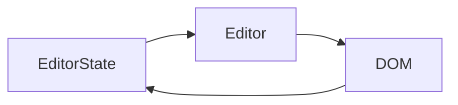
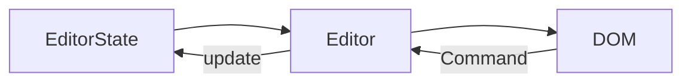

# Brand-new Rich Text Editor Framework!

先日 Meta から新しいリッチテキストエディターのフレームワーク **Lexical** の OSS 化が発表されました。

https://github.com/facebook/lexical

https://lexical.dev

一方で、 Meta が開発していた既存の React 用リッチテキストエディターフレームワーク **Draft.js** はアーカイブが決定されました。

https://github.com/facebook/draft-js/pull/3136

実は自分は業務で Draft.js をめちゃくちゃ使っていて、発展に期待しつつウォッチしていたので開発が終了してしまうのが非常に残念ではあるのですが、代わりにより高度に抽象化されたフレームワークが公開されたのでこれはマスターするしかありません。

ということで調べたことをまとめていこうと思います。

執筆時点(2022 年 4 月)では正式リリースされていないので、本稿のサンプルコードは参考にならなくなる可能性があります。

## 概要

### エディターを作るためのフレームワーク

他のリッチテキストエディターライブラリと異なり、テキストエディターを作るためのフレームワークです。なので、最小構成で使用しても `contentEditable` な `div` が画面に表示されるだけで見た目は何も付いていません。ツールボタンやエディターのスタイリング等は Lexical に乗っかって自作していく必要があります。これに関しては Draft.js の頃から変わりません。

出来合いの見た目でいいからすぐにリッチテキストエディターが使いたいという人は他のテキストエディターライブラリを検討するか、 Lexical ベースで開発されたライブラリが出現するのを待つ必要があります。

### framework-agnostic

Lexical は特定のビューライブラリやフレームワークに依存しません。 Meta 製なので React 専用と思われるかもしれませんが、 Vue でも VanillaJS でも使えるようになっています。この点は React 専用フレームワークだった Draft.js との大きな違いですね。

### collaborative editing

Lexical を使うと共同編集可能なテキストエディターが開発できるようです。

ドキュメントでは[「作れるようになるよ」と言ってる](https://lexical.dev/docs/intro#what-can-be-built-with-lexical)だけで具体的な概念の説明やサンプルコードはありません(執筆時点)。しかしモノレポには [`@lexical/yjs`](https://github.com/facebook/lexical/tree/main/packages/lexical-yjs) というパッケージが含まれており、 Yjs を使用することを示しています。

Yjs は共同編集のためのデータ構造を提供するライブラリです。 Lexical を使って共同編集エディターを開発するつもりの方は先行してキャッチアップしておくと良さそうです。

https://yjs.dev/

## 設計

Lexical の設計について触れていきます。

### 単方向データバインディング

Lexical のライフサイクルには大きく分けて 3 つの概念が登場します。

- EditorState
- Editor
- DOM(contentEditable)

EditorState はエディターの状態を保持する immutable なモデルです。immutable ですが Draft.js と異なり [immutable.js](https://immutable-js.com/) は使われていません。 EditorState は編集中のコンテンツデータと Selection(文字選択やキャレットのこと)を管理します。

Editor は Lexical のコア API で本体を指します。EditorState を内部で保持しており、現在の EditorState と新しい EditorState を差分比較して DOM を更新する Reconciler を持っているようです。

ユーザーは contentEditable な DOM 上でキーボード入力することでエディターを操作しますが、内部では EditorState の新しいインスタンスが生成されて Editor に渡されることで DOM の更新がかかります。



おや、、、これはどこかで知っている流れですね 🤔

そう、みんな大好き React の DOM 更新フローです。React では State から仮想 DOM を組み立てて React に渡すと最も効率の良い手順で実 DOM を更新してくれますが、それと似ています。Lexical が EditorState の差分から DOM 更新を最適な手段でやってくれるので、contentEditable な DOM を扱う辛みをほとんど吸収してくれます。

ドキュメントにもはっきりと、 DOM ではなく EditorState が **the source of truth(信頼できる唯一の情報源)** だと述べられています。

https://lexical.dev/docs/concepts/editor-state

ちなみに、 Draft.js にも同じく EditorState という名前のモデルクラスが存在します。同様に、編集しているコンテンツと Selection を管理していますが、Draft.js と Lexical に互換はありません。Lexical は Draft.js の反省を活かして開発が進められているだろうとは思いますが、あくまで別物であることに注意が必要です。 [Draft.js から Lexical に移行するためのガイダンスをいつか書く](https://github.com/facebook/lexical/issues/1641)と述べられてはいますが、 Draft.js をかなり薄く使っていないと簡単にはいかないと思われます(想像)(Draft.js plugins とか使ってるともっと大変そう)。

### EditorState の中身

EditorState について深堀りします。

EditorState は内部で 2 つのデータを持ちます:

- Node ツリー
- Editor selection

EditorState はクラスですが、JSON にシリアライズ可能です。逆に、JSON から EditorState を完全に復元することも保証します。

#### Node

https://lexical.dev/docs/concepts/nodes

編集中のデータは Node という単位でツリー状に管理されます。例えばユーザーが「H1 ブロック」をエディターに追加すると、 `HeadingNode` が EditorState に挿入され、その子要素として `TextNode` が挿入される、といった具合です。DOM と対応するモデルなので、HTML に慣れていれば直感的ですね。

実装寄りの話をすると、 `LexicalNode` というベースクラスがあってそれを継承して具象のクラスを作成します。ビルトインの Node が複数ありますが、独自実装も可能です。注意点として、 EditorState が JSON シリアライズ可能であるため、 Node もシリアライズ可能であることを求められます(クラスなので独自プロパティを持てるが、 `Map` や `Set` 等で持ってはいけない)。

コンテンツに対してどんなビューを描画するかも Node が持ちます。ビューは `document.createElement()` で生成するものが基本ですが、 React コンポーネントでも描画できるようです(仕組みはよくわかっていません)。

#### Selection

Selection はエディターの選択状態を表現するモデルです。選択だけでなく、キャレット(編集エリアでピコピコしている縦棒のこと)状態も Selection で管理されます。

エディター上で文字を選択しているときだけインラインスタイルを切り替えるツールボタン UI を表示する、みたいな機能を実装する時、 Selection を読み取ることで表示可否を判定できます。

Selection には種類があり、 `RangeSelection`, `NodeSelection`, `GridSelection` があるようです。テキストレベルで選択している時は `RangeSelection`、 Node レベルで選択しているときは `NodeSelection` になるのですが、 `GridSelection` についてはドキュメントが整備されておらず不明です(執筆時点)。

そもそもエディターにフォーカスがない場合は Selection は `null` になります。

### Commands

ユーザーによるすべての操作は **Command のディスパッチ**に変換されます。特定の Command に対して予め実行する処理を Editor に登録しておき、 Editor が Command を受け取ったらその処理(多くは EditorState の更新)を行います。



おや、、、この流れもどこかで知っているな 🤔

Meta が提唱している Flux のフローですね。 Lexical の文脈では Command と呼ばれていますが、 Flux の Action とみなすことができます。予め登録しておく処理は reducer に相当します。 Action がディスパッチされたら reducer がステートを更新する流れである Flux を意識しているような Command のフローです(僕がそう思っただけでドキュメントに記載があるわけではありませんが)。

Flux 同様、 Command をディスパッチする際にペイロードを付与することもできます。例えばエディターにテキストカラーを変更する UI を搭載したい場合は、 `TEXT_COLOR_COMMAND` とともに何色にするかの情報を一緒にディスパッチします。

上の図が単方向データバインディングに見えなくなっているかもしれませんが、 EditorState 更新処理を Editor に登録するだけであって Command が Editor に何か作用するわけではありません。ですので、処理の流れは依然として EditorState --> Editor --> DOM --> EditorState のループです。

### Node Transforms

Node 単位で変換をかける処理 **Node Transform** を Editor に対して予め登録しておくことができます。 EditorState が変更されて DOM に適用される前に Node Transform で更に EditorState が書き換えられます。

一度の EditorState の変更によって複数の transform が作用することがあります。しかし、いくつの transform が発行されても最終的に行われる DOM 更新は一度だけです。


*https://lexical.dev より引用*

例えば Twitter のツイート入力欄は `"@"` から始まる文字列はメンション先として青色に装飾されます。その機能を実装するときに Node Transforms が使えて、入力に応じて Node を差し替えていくことで実現できます。

### `$` prefixed functions

Lexical のパッケージから export されている `$` で始まる名前の関数は特別な場所でしか使えないようになっています。それは、次のメソッドのコールバック関数の中です。

- `editor.update(() => {})`
- `editorState.read(() => {})`

(他にもあるっぽいですが全部特定できてません。)

ドキュメントでは「React Hooks がコンポーネント内部でしか使えないのと似ている」と説明されています。ただし、 `$` プレフィックス関数はトップレベルである必要も、順番の固定を保証する必要もないようで React Hooks と比べるとだいぶ制約は弱いです。

## 実装例

ここまでは概念をコードなしで説明してきました。ここからは実装例を交えながら説明していきます(動くサンプルは最後に載せています)。

### 最小構成

```sh
npm install lexical
```

HTML に `<div id="editor" contenteditable="true"></div>` が含まれているとします。

```ts
import { createEditor } from "lexical";

const editorRoot = document.getElementById("editor");

const editor = createEditor();

editor.setRootElement(editorRoot);
```

`createEditor` で Editor インスタンスを生成して、エディターのビューをレンダリングする `div` 要素を指定します。 `div` 要素は予め `contenteditable` にしておく必要があります。

この状態では、 `contenteditable` なのでキャレットは当たりますが入力ができません。なぜでしょう。

ユーザーの操作はすべて **Command のディスパッチ** に変換されるはずでしたね。 `editor` にはデフォルトの動作が何も登録されていないので、キーボード入力すら反応しません。ユーザーのテキスト入力によって発行される Command に対して EditorState の更新を行う処理を追加しましょう。

```ts
editor.registerCommand(
  INSERT_TEXT_COMMAND,
  (text: string) => {
    const selection = $getSelection();
    selection?.insertText(text);
    return true;
  },
  COMMAND_PRIORITY_EDITOR
);
```

`INSERT_TEXT_COMMAND` はユーザーのキーボード入力によってディスパッチされるコマンドです。それを受け取ったら実行する処理を `editor` に登録します。こんな感じで色々な Command に対して処理を登録しないとまともに動くエディターにならないのですが、テキストエディターのよくあるキーバインド(Cmd+B でボールドスタイルを適用するなど)は用意しておいてほしいですよね。もちろん用意してあります。

- plain-text なエディターの場合

  最低限のテキストエディターです。ほとんど `textarea` と変わりないです。

  ```sh
  # peerDependencies 含む
  npm install @lexical/plain-text @lexical/utils @lexical/selection @lexical/clipboard
  ```

  https://github.com/facebook/lexical/blob/f3c5e8bc6897dabfcebd13112e57c253c7d325e7/packages/lexical-plain-text/src/index.js

  ```ts
  import { createEditor } from "lexical";
  import { registerPlainText } from "@lexical/plain-text";

  const editorRoot = document.getElementById("editor");
  const editor = createEditor();
  editor.setRootElement(editorRoot);
  registerPlainText(editor); // ここで一括登録
  ```

- rich-text なエディターの場合

  よくあるリッチテキストエディターの構成です。Cmd+B でボールドになったり Tab でインデントができます。

  ```sh
  # peerDependencies 含む
  npm install @lexical/rich-text @lexical/utils @lexical/selection @lexical/clipboard
  ```

  https://github.com/facebook/lexical/blob/f3c5e8bc6897dabfcebd13112e57c253c7d325e7/packages/lexical-rich-text/src/index.js

  ```ts
  import { createEditor } from "lexical";
  import { registerRichText } from "@lexical/rich-text";

  const editorRoot = document.getElementById("editor");
  const editor = createEditor();
  editor.setRootElement(editorRoot);
  registerRichText(editor); // ここで一括登録
  ```

### テキストに応じて文字色が変化する Node を作ってみる

入力されたテキストに応じて色を変更したいケースは多いと思います。今回は `"color:red"` のようなテキストを受け取ったら、その色がフォントカラーになるような TextNode を作ってみます。

まずは色を判定する関数。 StackOverflow で見つけました。 `new Option()` とかいうの初めて見た…。

```ts
// https://stackoverflow.com/questions/48484767/javascript-check-if-string-is-valid-css-color
const isValidColor = (strColor: string) => {
  const s = new Option().style;
  s.color = strColor;
  return s.color !== "";
};
```

そして色が切り替わる専用の Node を TextNode を継承して作ります。継承してオリジナルの Node を作る手順はドキュメントに記載されています([ページ](https://lexical.dev/docs/concepts/nodes))。

```ts
import { TextNode } from "lexical";

export class AnyColoredTextNode extends TextNode {
  private __color: string;
  constructor(color: string, text: string, key?: NodeKey) {
    super(text, key);
    this.__color = color;
  }
}
```

内部プロパティとして `__color` を持ちます。コンストラクタで継承元である `TextNode` のコンストラクタ引数に加えて独自の `color` を取ります。

続いて、独自 Node クラスには 2 つの必須な static メソッドを生やす必要があるようです。 `static getType()` と `static clone()` です。 type は EditorState を JSON から復元するために使用され、clone は EditorState のスナップショットの作成に使用されるとのこと。

```ts
export class AnyColoredTextNode extends TextNode {
  /* other properties */

  static getType(): string {
    return "any-colored";
  }
  static clone(node: AnyColoredTextNode): AnyColoredTextNode {
    return new AnyColoredTextNode(node.__color, node.__text, node.__key);
  }
}
```

ところで、 `__color` は private プロパティですが、外から読みたいこともあるでしょう。その場合、アクセサとして `getColor()` と `setColor(color)` を生やしても良いのですが、書き方に癖があるので要注意です。

```ts
export class AnyColoredTextNode extends TextNode {
  /* other properties */

  getColor(): string {
    const self = this.getLatest<AnyColoredTextNode>();
    return self.__color;
  }

  setColor(color: string): void {
    const self = this.getWritable<AnyColoredTextNode>();
    self.__color = color;
  }
}
```

`getLatest()` で EditorState から最新の Node インスタンスを取得します。取得した最新のインスタンスの `__color` 返却するようにします。

また、`getWritable()` でクローンを作ってからミューテーションを行います。 EditorState は immutable なので `this.__color = color` などとやってはいけません。

続いて Node と対応する DOM を返すメソッドです。

```ts
export class AnyColoredTextNode extends TextNode {
  /* other properties */

  createDOM(config: EditorConfig<{}>): HTMLElement {
    const element = super.createDOM(config);
    element.style.color = this.__color;
    return element;
  }
  updateDOM(
    prevNode: AnyColoredTextNode,
    dom: HTMLElement,
    config: EditorConfig<{}>
  ): boolean {
    const isUpdated = super.updateDOM(prevNode, dom, config);
    if (prevNode.__color !== this.__color) {
      dom.style.color = this.__color;
    }
    return isUpdated;
  }
}
```

`createDOM` も `updateDOM` も基本は親クラスに処理を渡すだけですが、スタイルに自分が持っている `__color` を当てる処理だけ追加しています。

また、独自 Node クラスを作成したら そのクラスインスタンスを操作するユーティリティ関数を `$` プレフィックスで定義することを[**エチケット**として推奨しています](https://lexical.dev/docs/concepts/nodes#:~:text=It%27s%20also%20good%20etiquette%20to%20provide%20some%20%24%20prefixed%20utility%20functions%20for%20your%20custom%20ElementNode%20so%20that%20others%20can%20easily%20consume%20and%20validate%20nodes%20are%20that%20of%20your%20custom%20node.)。

```ts
export function $createAnyColoredTextNode(
  color: string,
  text: string
): AnyColoredTextNode {
  return new AnyColoredTextNode(color, text);
}

export function $isAnyColoredTextNode(node: LexicalNode): node is AnyColoredTextNode {
  return node instanceof AnyColoredTextNode;
}
```

自作 Node は完成しました。続いて、標準の TextNode に `"color:red"` と入力されたら TextNode を AnyColoredTextNode に変換する処理を書きます。 Node Transforms の出番です。

まずは `TextNode` -> `AnyColoredTextNode` の変換です。 valid な color を入力してもらえた時だけ変換します。変換処理は Editor に対して登録します。

```ts
editor.registerNodeTransform(TextNode, (textNode: TextNode) => {
  const text = textNode.getTextContent();
  const matched = /color:(.*)/.exec(text);
  if (matched !== null) {
    const color = matched[1];
    if (isValidColor(color)) {
      textNode.replace($createAnyColoredTextNode(color, text));
    }
  }
});
```

`registerNodeTransform` の第 1 引数は変換対象の Node クラスです。クラスなので TS から JS にコンパイルされても実体があり引数に渡せます。 `textNode.replace` で全体のツリーから見たその Node の位置を別の Node で置き換えることができます(執筆時点で `node.replace` についてドキュメントなし)。正規表現で入力されたテキストから `color` を取り出して `isValidColor(color)` を満たせば `AnyColoredTextNode` に差し替えます。

続いて `AnyColoredTextNode` -> `TextNode` の変換です。入力されたテキストが `"color:red"` にマッチしなくなったら標準の `TextNode` に戻してあげます。また、別の色を入力されたら Node はそのままでフォントカラーが変わるようにします。

```ts
editor.registerNodeTransform(AnyColoredTextNode, (node: AnyColoredTextNode) => {
  const text = node.getTextContent();
  const matched = /color:(.*)/.exec(text);
  if (matched === null) {
    node.replace($createTextNode(text));
  } else {
    const color = matched[1];
    const currentColor = node.getColor();
    if (color !== currentColor && isValidColor(color)) {
      node.setColor(color);
    }
  }
});
```

`registerNodeTransform` の第 1 引数で指定する変換ターゲットは今度は `AnyColoredTextNode` です。 `matched === null` の時は `TextNode` に置き換えます。また、マッチしてかつ指定された色が変わっていれば、定義しておいた `setColor` メソッドで色を変更します。

ところで、Lexical の `registerXXX` と命名されたメソッドには実は戻り値があります。登録を解除するための関数です。 `useEffect` のクリーンアップでの使用を意識しているようです。今回 2 つの `registerNodeTransform` を使いましたが、複雑なリッチテキストエディターを開発する場合、もっとたくさんの `registerXXX` を使うことになるでしょう。ひとつずつ登録解除していくのは面倒なので、公式でマージユーティリティを用意してくれています(執筆時点でドキュメントなし)。

```ts
import { mergeRegister } from "@lexical/utils";

const bulkUnregister = mergeRegister(
  editor.registerNodeTransform(OneNode, (node) => {}),
  editor.registerNodeTransform(TwoNode, (node) => {}),
  editor.registerNodeTransform(ThreeNode, (node) => {})
);

bulkUnregister(); // 全部の register を解除したことになる
```

今回用意する `registerNodeTransform` は 2 つだけですが、せっかくなので `mergeRegister` を使ってラップします。

```ts
export function registerTransformAnyColoredText(editor: LexicalEditor): () => void {
  return mergeRegister(
    editor.registerNodeTransform(TextNode, (textNode: TextNode) => {
      /* TextNode -> AnyColoredTextNode */
    }),
    editor.registerNodeTransform(AnyColoredTextNode, (node: AnyColoredTextNode) => {
      /* AnyColoredTextNode -> TextNode */
    })
  );
}
```

`registerTransformAnyColoredText` は `editor` を受け取って登録解除関数を返すようなインターフェイスの関数です。`@lexical/rich-text` のようなコア以外のプラグインライブラリに倣っています。

:::details `AnyColoredTextNode` のコード全体

```ts
import {
  TextNode,
  EditorConfig,
  LexicalNode,
  LexicalEditor,
  NodeKey,
  $createTextNode,
} from "lexical";
import { mergeRegister } from "@lexical/utils";

export class AnyColoredTextNode extends TextNode {
  private __color: string;
  constructor(color: string, text: string, key?: NodeKey) {
    super(text, key);
    this.__color = color;
  }

  static getType(): string {
    return "any-colored";
  }
  static clone(node: AnyColoredTextNode): AnyColoredTextNode {
    return new AnyColoredTextNode(node.__color, node.__text, node.__key);
  }

  getColor(): string {
    const self = this.getLatest<AnyColoredTextNode>();
    return self.__color;
  }

  setColor(color: string): void {
    const self = this.getWritable<AnyColoredTextNode>();
    self.__color = color;
  }

  createDOM(config: EditorConfig<{}>): HTMLElement {
    const element = super.createDOM(config);
    element.style.color = this.__color;
    return element;
  }
  updateDOM(
    prevNode: AnyColoredTextNode,
    dom: HTMLElement,
    config: EditorConfig<{}>
  ): boolean {
    const isUpdated = super.updateDOM(prevNode, dom, config);
    if (prevNode.__color !== this.__color) {
      dom.style.color = this.__color;
    }
    return isUpdated;
  }
}

export function $createAnyColoredTextNode(
  color: string,
  text: string
): AnyColoredTextNode {
  return new AnyColoredTextNode(color, text);
}

export function $isAnyColoredTextNode(node: LexicalNode): node is AnyColoredTextNode {
  return node instanceof AnyColoredTextNode;
}

export function registerTransformAnyColoredText(editor: LexicalEditor): () => void {
  return mergeRegister(
    editor.registerNodeTransform(TextNode, (textNode: TextNode) => {
      const text = textNode.getTextContent();
      const matched = /color:(.*)/.exec(text);
      if (matched !== null) {
        const color = matched[1];
        if (isValidColor(color)) {
          textNode.replace($createAnyColoredTextNode(color, text));
        }
      }
    }),
    editor.registerNodeTransform(AnyColoredTextNode, (node: AnyColoredTextNode) => {
      const text = node.getTextContent();
      const matched = /color:(.*)/.exec(text);
      if (matched === null) {
        node.replace($createTextNode(text));
      } else {
        const color = matched[1];
        const currentColor = node.getColor();
        if (color !== currentColor && isValidColor(color)) {
          node.setColor(color);
        }
      }
    })
  );
}

// https://stackoverflow.com/questions/48484767/javascript-check-if-string-is-valid-css-color
const isValidColor = (strColor: string) => {
  const s = new Option().style;
  s.color = strColor;
  return s.color !== "";
};
```

:::

ここまでで独自 Node クラスとそれを変換する `registerTransformAnyColoredText` を用意しました。それを Editor に対して使ってみましょう。

```ts
const editorRoot = document.getElementById("editor");

const editor = createEditor({
  nodes: [AnyColoredTextNode], // here
  onError: console.error,
});

editor.setRootElement(editorRoot);

registerPlainText(editor);

registerTransformAnyColoredText(editor); // here
```

`createEditor` を実行する時点で、自作 Node を登録する必要があります。

さぁ、動作確認してみましょう。下の CoddSandbox のプレビューに `"color:red"` のような文字列を入力してみてください。 valid なカラーなら何でも大丈夫です。

@[codesandbox](https://codesandbox.io/embed/zealous-golick-bkz7gb?fontsize=14&hidenavigation=1&theme=dark)

フォントカラーが変わりますね！

## まとめ

Meta の新しいリッチテキストエディターフレームワーク Lexical について調べたことを書いてきました。また、自作 Node を実装するサンプルを紹介しました。

Lexical は React に倣ったデータフローや拡張性の高い構成で、パワフルなリッチテキストエディターが開発できるようになっています。Draft.js にはなかった共同編集エディターも開発可能になるので、 CMS のようなサービスで重宝されそうです。

自分は Draft.js で苦しんだことが多かったので、Lexical の登場に非常にワクワクしています。

それではよい Lexical ライフを！
